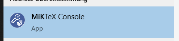
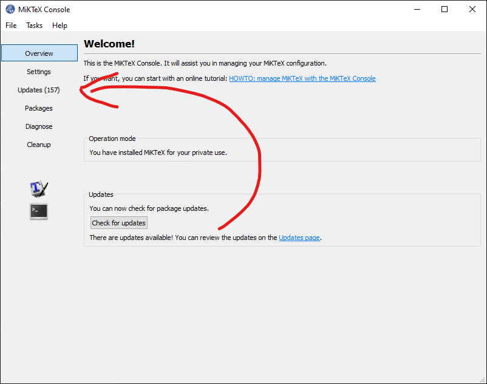
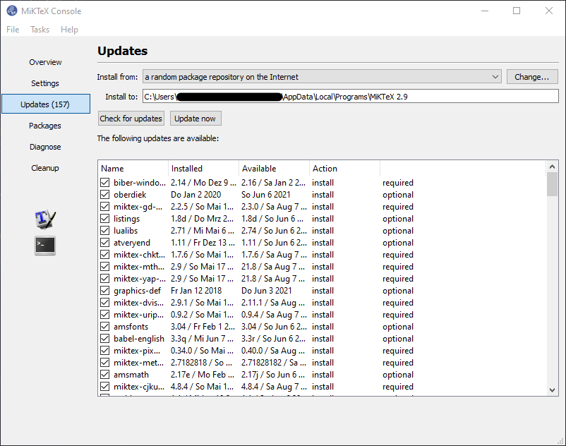
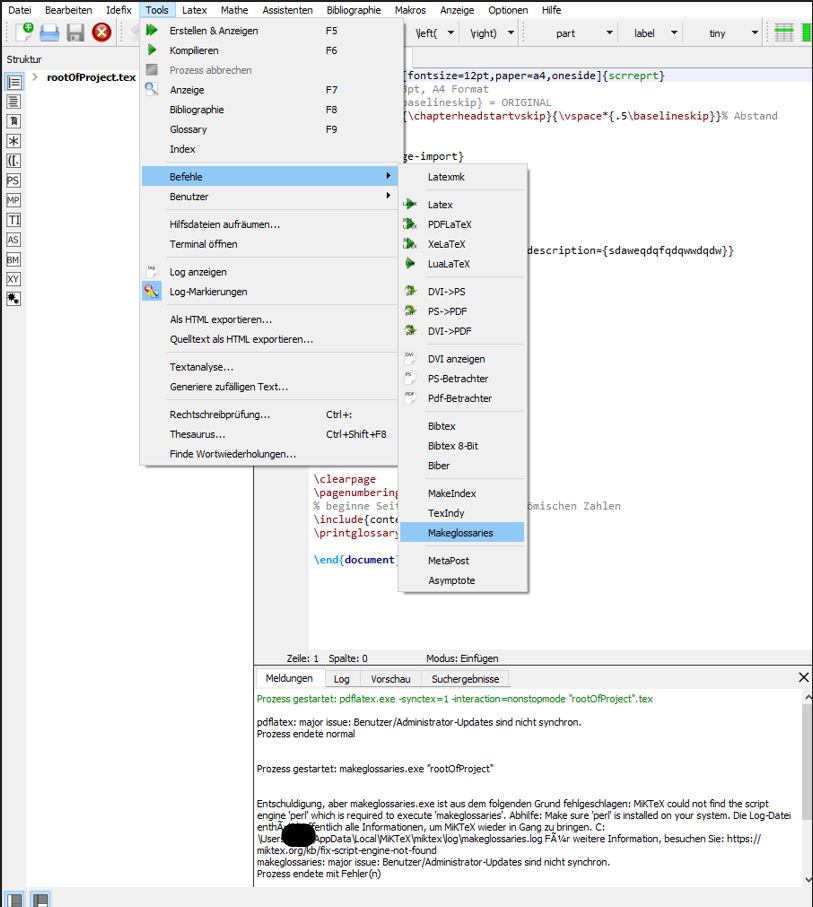
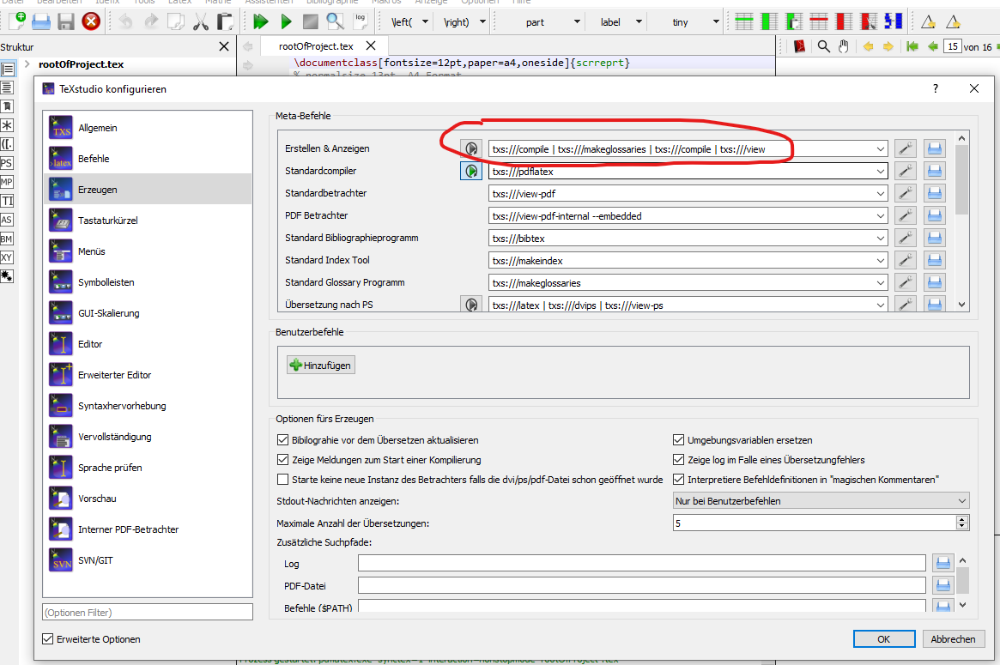
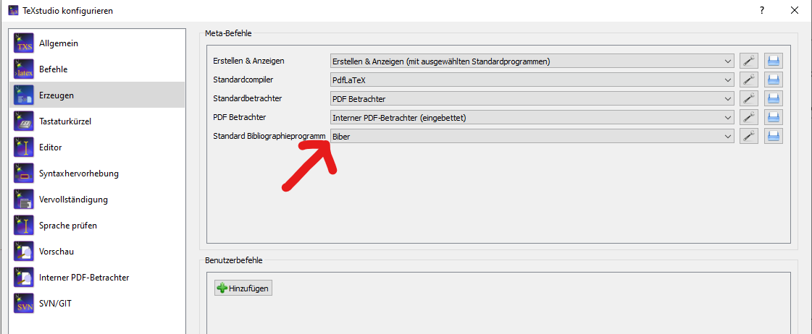

# Latex-Projektarbeit-Vorlage
Eine in Latex geschriebene Vorlage für die Projektdokumentation vom Fachinformatiker Systemintegration oder Anwendungsentwickler

#### notwendige Software
[TeXstudio](https://www.texstudio.org/) = Compiler & IDE

#### installiere Updates
- Starte MiKTeX Console

- Drücke auf "Check for Updates" und folge den Anweisungen auf den Screenshots

- Nachdem Updates gefunden wurden können diese bei updates installiert werden



#### Konfiguration
###### um ein Glossar erstellen zu können:
- [installiere Perl](https://www.activestate.com/products/perl/downloads/) mit CMD auf Windows
```cmd
powershell -Command "& $([scriptblock]::Create((New-Object Net.WebClient).DownloadString('https://platform.activestate.com/dl/cli/w20598w01/install.ps1'))) -activate-default ActiveState/Perl-5.32"
```
- manuelles erstellen des Glossars

- automatisches erstellen des Glossars beim Kompelier Vorgang
*Diese Einstellung sollte nicht notwendig sein, aber falls das Glossar nicht erstellt wird siehe Screenshot.*


###### um ein Literaturverzeichnis erstellen zu können:


#### IDE starten & LaTex Datei kompelieren
- Starte TeXstudio
- Öffne "rootOfProject.tex"
- Drücke F5 oder drücke auf den grünen Play Pfeil

#### hilfreiche Links
- [Geometry Hilfe](https://www.namsu.de/Extra/pakete/Geometry.html)
- [Tabellen erstellen Hilfe](https://www.tablesgenerator.com/)

## Wie verwende ich:
#### Abkürzungsverzeichnis / Acronyme

#### Abbildungsverzeichnis / List of Figures

#### Tabellenverzeichnis / List of tables

#### Glossar

#### Literatur
